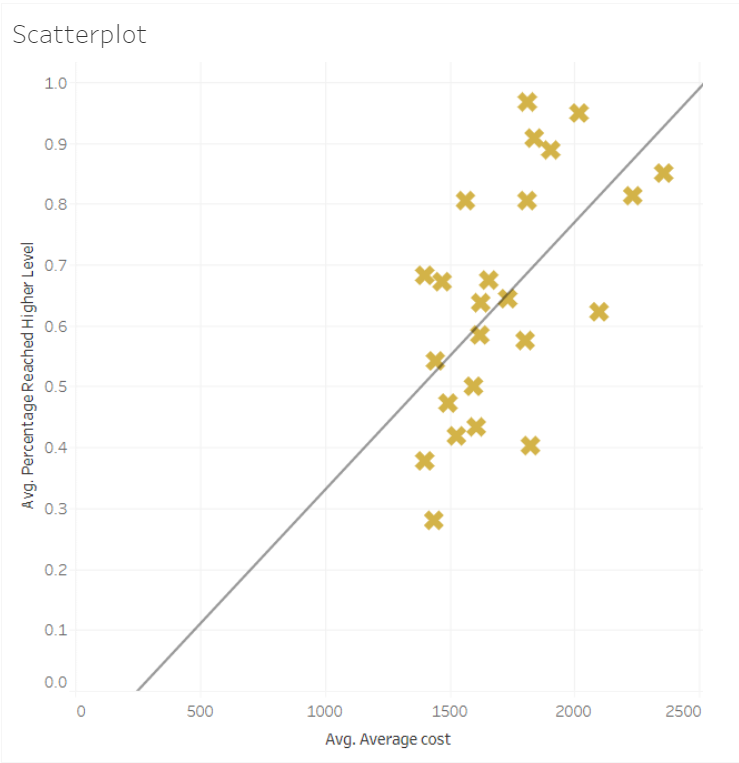

# Access-to-Third-Level-and-Wealth-Disparity

[Link to this webpage](https://aoifehoran97.github.io/Access-to-Third-Level-and-Wealth-Disparity/)  

<h1>The more expensive a place is to rent in Dublin the more likely a teen in the area will progress to third level, new research reveals.<h1>  
  
 <strong> Here is the interactive map with the Average Rent Prices, Average Third-Level Progression Rates and Second-Level School locations in Dublin.</strong> 
 - 
 

 

<iframe src="https://www.google.com/maps/d/u/0/embed?mid=11Z7C4pZofy8x8XIXdGq5rym34vl6tTBZ" width="640" height="480">  </iframe>  
-  
- 
- 

<h4>NEW research has shown that the more expensive a place is to rent, the higher the rates of third level progression were in 2016. 
</h4>  

Those living in Dublin 14, in areas such as Rathfarnam and Dundrum, lucked out with the highest rates of progression to third level among Leaving Certificate Students at 97 per cent with average rental costs nearly €600 below the most expensive areas.

Those renting in Dublin 2 see the highest rental prices, averaging at around €2,358.6 per month but still have a majority success at third level progression with 85 per cent of those educated in the area accepting offers in third level institutions.

Other areas with a high third level progression rate and rental price include predominantly Southside areas such as Dublin 6, Dublin 6 West, Dublin 4, Dublin 18 and Dublin 20.

The worst contending postal area for third level progression is Dublin 17, which includes areas such as Darndale, Coolock, Priorswood and part of Santry. 

This area has a rental price of €1,437 but an average progression to third level of only 28%, it is however, important to note that there is only one second level institution in this area, Colaiste Dhulaigh, and the majority of young people in the area are educated in the surrounding areas. 

When assessed the data has a correlation of 0.59, with the highest being 1 and the lowest being -1, this definitely shows that there is a strong correlation between higher rental prices and academic success in the Dublin region.  
